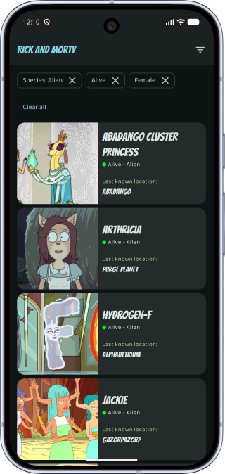
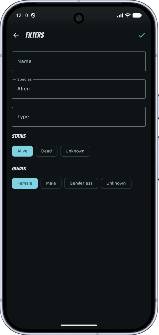
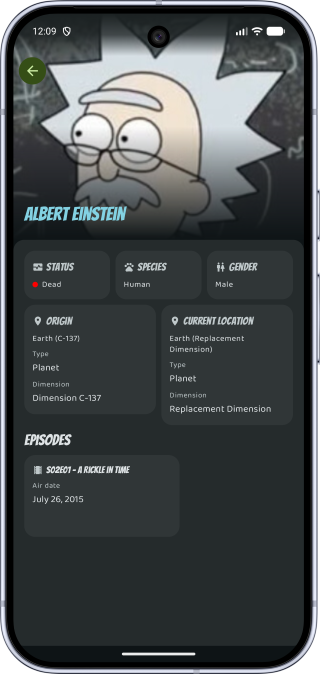
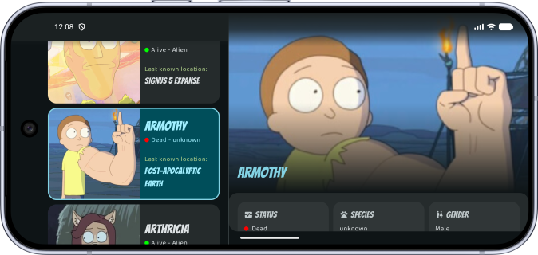

# Rick & Morty

A Kotlin Multiplatform (Android + iOS) app for browsing characters from the
[Rick and Morty API](https://rickandmortyapi.com/), built with Compose Multiplatform
and a fully modularized, offline-first architecture.

## Screenshots

<p align="center">
  
  
  
</p>

Adaptive two-pane list/detail layout on expanded-width windows (tablets, landscape):

<p align="center">
  
</p>

## Features

- **Character list** with endless scrolling backed by Paging 3 and a `RemoteMediator`,
  so pages are fetched from the network, cached in a local database, and served from there.
  Pull-to-refresh forces a fresh fetch, bypassing the HTTP cache.
- **Filtering** by name, species, type, status, and gender. Active filters show as
  dismissable chips with a *Clear all* shortcut; filter state is persisted in the database.
- **Character detail** screen with a collapsing hero image, status/species/gender cards,
  origin & current-location details, and an episode carousel.
- **Adaptive two-pane layout**: on expanded-width windows (tablets, landscape) the list and
  detail are shown side by side; on compact widths the detail is a separate screen with a
  shared-element image transition. In that single-pane mode, swiping left/right on the detail
  switches between characters, keeping the selection in sync with the list.
- **Offline-first**: the Room database is the single source of truth, so previously loaded
  content is available without a network connection.
- **Shared UI codebase** across Android and iOS via Compose Multiplatform.

## Architecture

The app follows a modularized, Now-in-Android-style structure with a clean
`data → domain → ui` layering inside each feature and unidirectional MVVM in the UI layer.

### Module graph

```
:androidApp ──► :shared (umbrella: App, navigation, DI aggregation, iOS framework)
                  │
                  ├──► :feature:characters ──► :feature:episode
                  │                        └─► :feature:location
                  │
                  ├──► :feature:episode ─┐
                  ├──► :feature:location ┤
                  │                      ▼
                  └──► :core:designsystem, :core:network, :core:database,
                       :core:image, :core:common
```

| Module | Responsibility |
| --- | --- |
| `:androidApp` | Thin Android entry point (`MainActivity`, manifest). |
| `:shared` | Umbrella module: `App` composable, type-safe navigation, `initKoin` aggregation, and the iOS framework. |
| `:feature:characters` | List, detail, filters, and two-pane screens with their ViewModels, use cases, repository, and DTOs. |
| `:feature:episode` / `:feature:location` | Data-only features (repository + data sources + mappers) consumed by the character detail. |
| `:core:common` | `Result`/`DataError` result types, shared domain models, platform helpers. |
| `:core:network` | Ktor `HttpClient` factory, `safeCall` wrapper, and the network Koin module. |
| `:core:database` | Room database, all entities/DAOs/converters (KSP runs only here), and the database Koin module. |
| `:core:designsystem` | Material 3 theme, shared UI helpers, and all Compose resources (strings, fonts). |
| `:core:image` | Coil image loader configuration. |
| `build-logic` | Gradle convention plugins that keep each module's build script minimal. |

### Build logic (convention plugins)

Shared Gradle setup lives in the `build-logic` included build as precompiled convention plugins,
so a module's build file is typically just a plugin id plus its dependencies:

- `rickandmorty.kmp.library` — KMP targets (Android + iOS), namespace, host tests, lint.
- `rickandmorty.kmp.feature` — the above plus Compose, Koin, and lifecycle for UI features.
- `rickandmorty.compose` — Compose Multiplatform + a public, per-module resource class.
- `rickandmorty.room` — Room + KSP wiring across all targets.
- `rickandmorty.lint` — kotlinter + detekt.

### Data flow

```
UI (Compose screen)
  → ViewModel (StateFlow / Paging flow)
    → UseCase
      → Repository (interface in domain, impl in data)
        → Remote data source (Ktor)  → API
        └ Local data source (Room DAO) → SQLite   ◄── single source of truth
```

The list uses a Paging 3 `RemoteMediator`: the UI observes a `PagingSource` over the Room
database, while the mediator fetches from the network and writes into the database on demand.

## Tech stack

| Concern | Library |
| --- | --- |
| UI | Compose Multiplatform, Material 3 |
| DI | Koin |
| Networking | Ktor client (kotlinx.serialization) |
| Persistence | Room + SQLite (bundled driver) |
| Paging | AndroidX Paging 3 (with `RemoteMediator`) |
| Images | Coil 3 (Ktor fetcher) |
| Navigation | Compose Navigation (type-safe routes) |
| Async | Kotlin Coroutines / Flow |
| Quality | kotlinter, detekt |
| Build | Gradle convention plugins, version catalog |

## Building & running

Requirements: JDK 17+, the Android SDK (compileSdk 37), and — for iOS — Xcode on macOS.

### Android

```bash
./gradlew :androidApp:installDebug
```

or open the project in Android Studio and run the `androidApp` configuration.

### iOS

Open `iosApp/iosApp.xcodeproj` in Xcode and run, or build the shared framework with:

```bash
./gradlew :shared:embedAndSignAppleFrameworkForXcode
```

## Testing

Unit and UI (Robolectric) tests run on the JVM host across all modules:

```bash
./gradlew testAndroidHostTest
```

iOS test compilation is verified with `compileKotlinIosArm64` / `compileKotlinIosSimulatorArm64`
(the simulator tests themselves require macOS).

## Code quality

```bash
./gradlew formatKotlin        # auto-fix formatting
./gradlew lintKotlin detekt   # verify style
```
