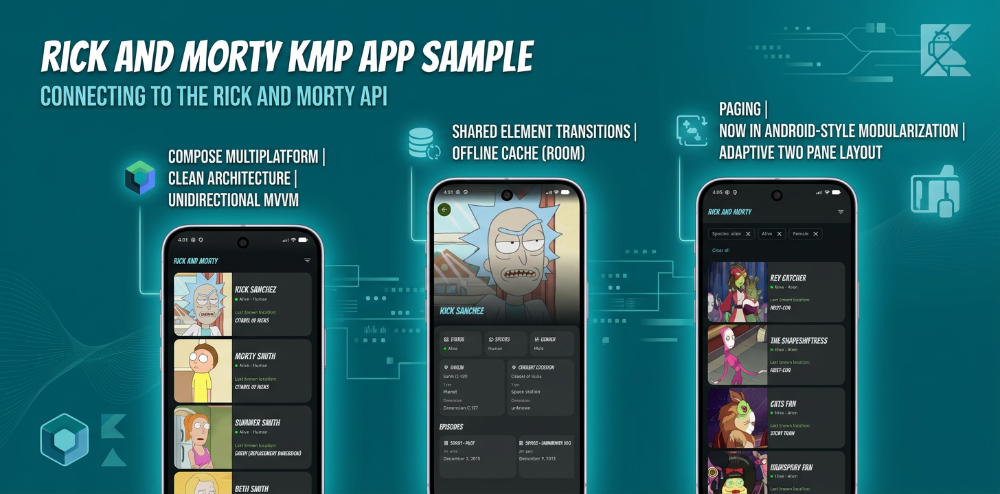
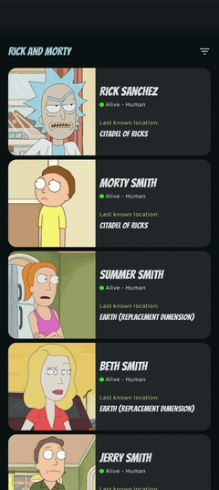
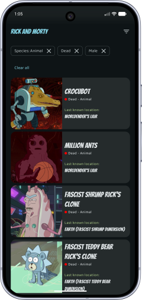
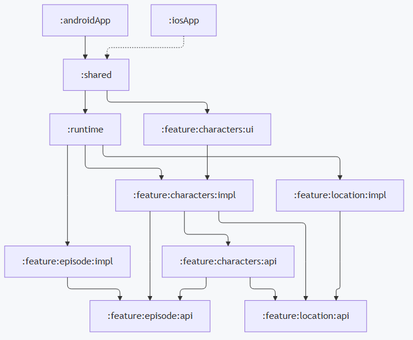
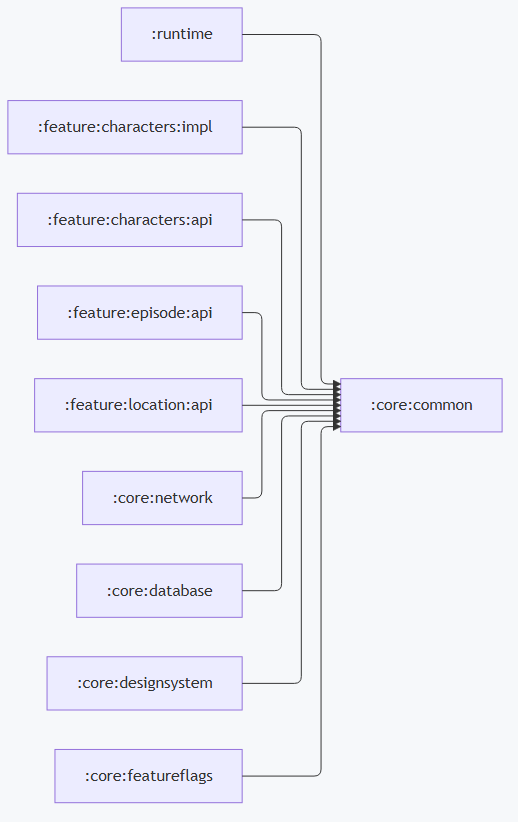
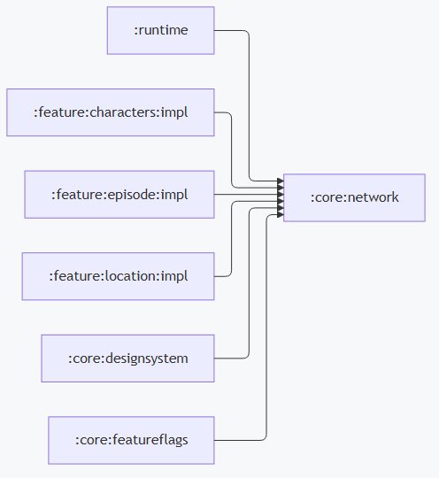
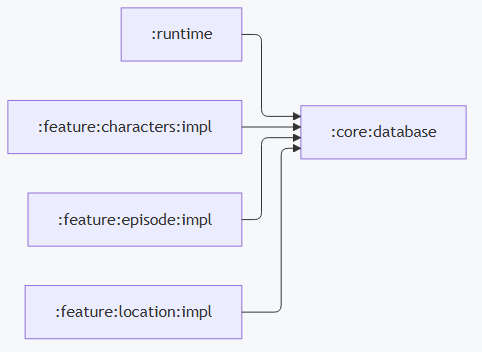
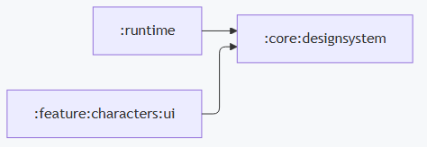
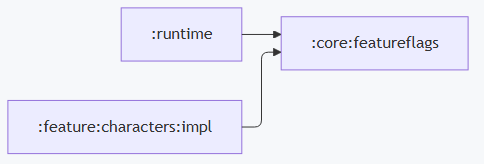
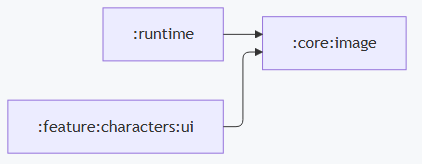

[](https://gitlab.com/milhauscz-mobile/RickAndMorty-KMP-Playground/-/commits/feature/sdk-showcase)
[](https://gitlab.com/milhauscz-mobile/RickAndMorty-KMP-Playground/-/releases)



[[_TOC_]]

# Rick & Morty SDK

Kotlin Multiplatform SDK for browsing the [Rick and Morty API](https://rickandmortyapi.com/).
Ship it as **published Maven artifacts** (Android / JVM) and an **XCFramework** (iOS), with optional
**Compose Multiplatform screens** you can drop into a host app.

This repository is mirrored on [GitLab](https://gitlab.com/milhauscz-mobile/RickAndMorty-KMP-Playground)
(CI, Package Registry, releases) and [GitHub](https://github.com/milhauscz/RickAndMorty-KMP-Playground).

## Branches

| Branch                                              | Contents                                                                                      |
|-----------------------------------------------------|-----------------------------------------------------------------------------------------------|
| `feature/sdk-showcase` | **SDK** - published Maven artifacts, XCFramework, GitLab CI publish/release, and the demo app |
| `main`                                 | **Playground app only** - shared KMP UI and offline-first architecture, no SDK packaging      |

You are viewing **`feature/sdk-showcase`** (SDK branch). For the playground app, switch to `main`.

## SDK at a glance

| | |
| --- | --- |
| **Entry point** | `:runtime` — `RickAndMortySdk.initialize`, isolated Koin, `RickAndMortySdkScope` |
| **Headless** | `:runtime` + `:feature:characters:impl` — repositories, use cases, domain models |
| **Widget** | `:runtime` + `:feature:characters:ui` — ready-made list, detail, and filter screens |
| **Version** | `0.1.0` (`VERSION_NAME` in `gradle.properties`) |
| **Demo** | `:shared` + `:androidApp` / `iosApp` — same integration a consumer would write |

## CI/CD

GitLab CI drives verification, publishing, and releases. The pipeline badge above tracks
`feature/sdk-showcase`; the release badge links to tagged SDK drops on the
[Package Registry](https://gitlab.com/milhauscz-mobile/RickAndMorty-KMP-Playground/-/packages)
and [Releases](https://gitlab.com/milhauscz-mobile/RickAndMorty-KMP-Playground/-/releases) page.

**When pipelines run**

| Trigger | What runs |
| --- | --- |
| Merge request | `lint`, `changelog`, `test`, `build` (debug APK) |
| Push to `development` | MR jobs + automatic release stage |
| **Run pipeline** (web UI) on any branch | MR jobs; release jobs appear as **manual** plays |

Direct pushes to other branches do not start a pipeline.

**Pipeline stages**

```
lint → test → build → release
```

| Stage | Jobs | Purpose |
| --- | --- | --- |
| lint | `lint`, `changelog` | kotlinter, detekt, Konsist, ABI check; changelog section for `VERSION_NAME` |
| test | `test` | `testAndroidHostTest` across every module |
| build | `build` | `:androidApp:assembleDebug` artifact for reviewers |
| release | `deployLibs`, `deliverAndroidApp`, `publish-release`, `sbom` | Maven publish, release APK, GitLab release + tag, CycloneDX SBOM |

On `development`, the release stage publishes all library modules to the Maven registry
(`https://gitlab.com/api/v4/projects/85010253/packages/maven`), builds a signed release APK, and
creates a Git tag from `VERSION_NAME` with changelog notes and download links.

**Reusable components.** Job definitions live in `templates/` as [GitLab CI components](https://docs.gitlab.com/ci/components/)
(`base`, `gradle-quality`, `gradle-test`, `android-build`, `release`, `sbom`). The root
`.gitlab-ci.yml` includes them at `@$CI_COMMIT_SHA`, so the pipeline that ships the SDK runs
the same components it publishes. See [docs/ci-components.md](docs/ci-components.md).

## Consuming the SDK

### 1. Add the GitLab Package Registry

```kotlin
// settings.gradle.kts or root build.gradle.kts
dependencyResolutionManagement {
    repositories {
        google()
        mavenCentral()
        maven {
            url = uri("https://gitlab.com/api/v4/projects/85010253/packages/maven")
            credentials(HttpHeaderCredentials::class) {
                name = "Private-Token" // or "Job-Token" in CI
                value = findProperty("gitlab.token") as String? // PAT with read_api
            }
            authentication { create<HttpHeaderAuthentication>("header") }
        }
    }
}
```

### 2. Add dependencies

**Widget** (screens + data — brings `impl` transitively):

```kotlin
dependencies {
    implementation("cz.cernilovsky.kmp.rickandmorty:runtime:0.2.0")
    implementation("cz.cernilovsky.kmp.rickandmorty.feature.characters:ui:0.2.0")
}
```

**Headless** (data layer only):

```kotlin
dependencies {
    implementation("cz.cernilovsky.kmp.rickandmorty:runtime:0.2.0")
    implementation("cz.cernilovsky.kmp.rickandmorty.feature.characters:impl:0.2.0")
}
```

iOS hosts add the `RickAndMortySDK` XCFramework — see [docs/ios-integration.md](docs/ios-integration.md).

**Requirements:** Kotlin 2.4.0+, Android minSdk 24 / compileSdk 37, JVM 11+.

### 3. Initialize once at startup

The SDK runs in an **isolated Koin container** so it does not clash with the host app's DI.

Use [SdkMode](runtime/src/commonMain/kotlin/cz/cernilovsky/kmp/rickandmorty/runtime/SdkMode.kt) to declare intent:

| Mode | Entry point | What you get |
| --- | --- | --- |
| `Headless` (default) | `RickAndMortySdk.initialize(...)` | `RickAndMortySdk.get<T>()` for use cases / repositories |
| `Widget` | `RickAndMortySdk.initializeWidget(...)` from `:feature:characters:ui` | Compose screens; UI Koin module included automatically |

ViewModels and UI state/models are `@InternalRickAndMortyApi` — host apps use public screens (widget)
or `get()` (headless), not ViewModels or `Ui*` types.

**Headless example** after `initialize`:

```kotlin
val characters = RickAndMortySdk.get<GetCharactersUseCase>()
```

**Android widget** — typically in `Application.onCreate`:

```kotlin
import android.app.Application
import cz.cernilovsky.kmp.rickandmorty.characters.initializeWidget
import cz.cernilovsky.kmp.rickandmorty.runtime.RickAndMortySdk
import cz.cernilovsky.kmp.rickandmorty.runtime.RickAndMortySdkConfig
import cz.cernilovsky.kmp.rickandmorty.runtime.SdkMode

class MyApplication : Application() {
    override fun onCreate() {
        super.onCreate()
        RickAndMortySdk.initializeWidget(
            context = this,
            config = RickAndMortySdkConfig.builder()
                .mode(SdkMode.Widget)
                .baseUrl("https://rickandmortyapi.com/api")
                .loggingEnabled(BuildConfig.DEBUG)
                .build(),
        )
    }
}
```

**Android / iOS headless:**

```kotlin
RickAndMortySdk.initialize(
    context = this, // Android only
    config = RickAndMortySdkConfig.builder().mode(SdkMode.Headless).build(),
)
```

**iOS widget** — before showing any Compose UI (for example in `ComposeUIViewController` configuration):

```kotlin
import androidx.compose.ui.window.ComposeUIViewController
import cz.cernilovsky.kmp.rickandmorty.characters.initializeWidget
import cz.cernilovsky.kmp.rickandmorty.runtime.RickAndMortySdk

fun MainViewController() = ComposeUIViewController(
    configure = {
        RickAndMortySdk.initializeWidget()
    },
) {
    CharacterBrowser()
}
```

From Swift (headless), the call is `RickAndMortySdkIosKt.initialize(config:extraModules:)`. See [docs/ios-integration.md](docs/ios-integration.md).

Calling `initialize` with `SdkMode.Widget` but without the UI module fails fast — use `initializeWidget` instead.

### 4. Show the UI

Wrap SDK composables in `RickAndMortySdkScope` so they use the SDK's Koin graph.
Public screens live in `:feature:characters:ui`:

```kotlin
import androidx.compose.material3.MaterialTheme
import androidx.compose.runtime.Composable
import cz.cernilovsky.kmp.rickandmorty.characters.ui.CharacterListDetailScreen
import cz.cernilovsky.kmp.rickandmorty.characters.ui.filters.CharacterFiltersScreen
import cz.cernilovsky.kmp.rickandmorty.runtime.RickAndMortySdkScope

@Composable
fun CharacterBrowser() {
    RickAndMortySdkScope {
        MaterialTheme {
            // Adaptive list + detail (two-pane on wide windows). Wire navigation to filters as needed.
            CharacterListDetailScreen(
                onFilterClick = { /* navigate to CharacterFiltersScreen */ },
            )
        }
    }
}
```

**Android activity:**

```kotlin
class MainActivity : ComponentActivity() {
    override fun onCreate(savedInstanceState: Bundle?) {
        super.onCreate(savedInstanceState)
        setContent { CharacterBrowser() }
    }
}
```

`:shared` in this repo is the reference integration — `RickAndMortyApplication`, `MainViewController`,
and `App.kt` show the full navigation pattern.

### SDK documentation

| Document | Covers                                           |
| --- |--------------------------------------------------|
| [docs/publishing.md](docs/publishing.md) | Coordinates, versioning, local and CI publishing |
| [docs/api-compatibility.md](docs/api-compatibility.md) | Public API policy and semver rules               |
| [docs/feature-flags.md](docs/feature-flags.md) | Remote config, overrides, rollout bucketing      |
| [docs/ios-integration.md](docs/ios-integration.md) | XCFramework and Swift Package manifest           |
| [docs/ci-components.md](docs/ci-components.md) | Reusable GitLab CI components                    |
| [docs/sbom.md](docs/sbom.md) | CycloneDX bill of materials                      |
| [CHANGELOG.md](CHANGELOG.md) | Release notes for SDK consumers                  |

## Demo app

The included playground exercises the SDK the same way an integrator would.

   

Adaptive two-pane list/detail on expanded-width windows:


## Features

- **Character list** with endless scrolling backed by Paging 3 and a `RemoteMediator`,
  so pages are fetched from the network, cached in a local database, and served from there.
  Pull-to-refresh forces a fresh fetch, bypassing the HTTP cache.
- **Filtering** by name, species, type, status, and gender. Active filters show as
  dismissable chips with a *Clear all* shortcut; filter state is persisted in the database.
- **Character detail** screen with a collapsing hero image, status/species/gender cards,
  origin & current-location details, and an episode carousel.
- **Adaptive two-pane layout**: on expanded-width windows (tablets, landscape) the list and
  detail are shown side by side; on compact widths the detail is a separate screen with a
  shared-element image transition. In that single-pane mode, swiping left/right on the detail
  switches between characters, keeping the selection in sync with the list.
- **Offline-first**: the Room database is the single source of truth, so previously loaded
  content is available without a network connection.
- **Shared UI codebase** across Android and iOS via Compose Multiplatform.

## Architecture

Modularized, Now-in-Android-style `data → domain → ui` layering with unidirectional MVVM.
Dependency graph: [`docs/images/module-deps.json`](./docs/images/module-deps.json) · [full graph](./docs/images/module-graph.png)

**Overview** — apps, demo umbrella, runtime, and feature modules:

<p align="center">
  
</p>

**Per core module** — who depends on each `:core:*` module:

`:core:common`

<p align="center">
  
</p>

`:core:network`

<p align="center">
  
</p>

`:core:database`

<p align="center">
  
</p>

`:core:designsystem`

<p align="center">
  
</p>

`:core:featureflags`

<p align="center">
  
</p>

`:core:image`

<p align="center">
  
</p>

Each feature is split into **api** (domain contract), **impl** (data + use cases), and — where
applicable — **ui** (Compose screens and ViewModels). Cross-feature dependencies use **api**
modules only at compile time.

| Module | Responsibility |
| --- | --- |
| `:androidApp` | Thin Android entry point (`MainActivity`, manifest). |
| `:shared` | Demo umbrella: `App` composable, navigation, iOS framework. Not published. |
| `:runtime` | Published entry point: `RickAndMortySdk.initialize`, config, isolated Koin, `RickAndMortySdkScope`. |
| `:feature:characters:api` | Domain models and `CharactersRepository`. |
| `:feature:characters:impl` | Data layer, use cases, repository impl (no Compose). |
| `:feature:characters:ui` | Published widget: list, detail, filters screens. |
| `:feature:episode:api` / `:feature:location:api` | Domain models and repository interfaces. |
| `:feature:episode:impl` / `:feature:location:impl` | Repository implementations and Koin modules. |
| `:core:common` | `Result`/`DataError`, shared models, annotations. |
| `:core:network` | Ktor client, `safeCall`, network Koin module. |
| `:core:database` | Room database and Koin module (KSP runs only here). |
| `:core:designsystem` | Material 3 theme and Compose resources. |
| `:core:image` | Coil image loader. |
| `:core:featureflags` | Remote config, rollout bucketing, host overrides. |
| `:konsist` | Architecture tests (layer, api/impl/ui rules). |
| `build-logic` | Gradle convention plugins. |

### Build logic (convention plugins)

- `rickandmorty.kmp.library` — KMP targets, host tests, lint, publishing metadata.
- `rickandmorty.kmp.feature` — the above plus Compose, Koin, lifecycle.
- `rickandmorty.kmp.published` — `explicitApi()` and ABI validation.
- `rickandmorty.publish` — Maven coordinates and registry wiring.
- `rickandmorty.compose` / `rickandmorty.room` / `rickandmorty.lint`.

### Data flow

```
UI (Compose screen)
  → ViewModel (StateFlow / Paging flow)
    → UseCase
      → Repository (interface in domain, impl in data)
        → Remote data source (Ktor)  → API
        └ Local data source (Room DAO) → SQLite   ◄── single source of truth
```

## Tech stack

| Concern | Library |
| --- | --- |
| UI | Compose Multiplatform, Material 3 |
| DI | Koin (isolated SDK container) |
| Networking | Ktor + kotlinx.serialization |
| Persistence | Room + SQLite |
| Paging | AndroidX Paging 3 + `RemoteMediator` |
| Images | Coil 3 (Ktor fetcher) |
| Navigation | Compose Navigation (type-safe routes) |
| Async | Kotlin Coroutines / Flow |
| Quality | kotlinter, detekt, Konsist, Kotlin ABI validation |
| Build | Gradle convention plugins, version catalog |

## Building & running the demo

Requirements: JDK 17+, Android SDK (compileSdk 37), Xcode on macOS for iOS.

```bash
# Android demo
./gradlew :androidApp:installDebug

# iOS framework for Xcode
./gradlew :shared:embedAndSignAppleFrameworkForXcode

# SDK XCFramework for integrators
./gradlew :runtime:assembleRickAndMortySDKReleaseXCFramework

# Verify publishable artifacts locally
./gradlew publishAllPublicationsToLocalTestRepository
```

## Testing & quality

```bash
./gradlew testAndroidHostTest
./gradlew qualityCheck          # lint, detekt, Konsist, ABI check
./gradlew formatKotlin
```
